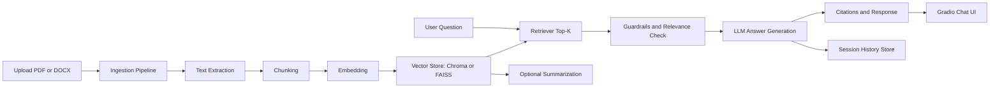

# System Flow Diagram

```mermaid
flowchart LR
    A[Upload PDF or DOCX] --> B[Ingestion Pipeline]
    B --> C[Text Extraction]
    C --> D[Chunking]
    D --> E[Embedding]
    E --> F[Vector Store: Chroma or FAISS]

    G[User Question] --> H[Retriever Top-K]
    F --> H
    H --> I[Guardrails and Relevance Check]
    I --> J[LLM Answer Generation]
    J --> K[Citations and Response]

    K --> L[Gradio Chat UI]
    J --> M[Session History Store]
    F --> N[Optional Summarization]
```